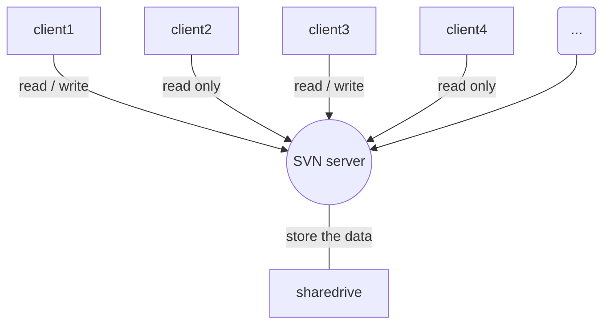
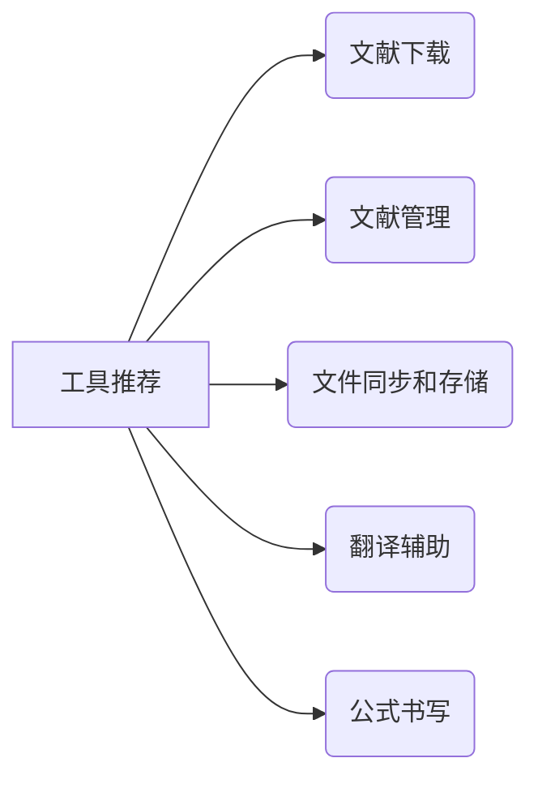

# 使用Markdown 绘制树形图

## 1 语法说明：

```
​```mermaid
graph TB 图表方向说明
/* 包括如下几类
- TB - top bottom(TD)
- BT - bottom top
- RL - right left 
- LR - left right
*/

节点关系说明（-->/--）|节点之间的文本|

​```
```

## 2 例子说明

示例1:

```
​```mermaid
graph TD
    subgraph SVN Architecture
    client1-->|read / write|SVN((SVN server))
    client2-->|read only|SVN
    client3-->|read / write|SVN
    client4-->|read only|SVN
    client5(...)-->SVN
    SVN---|store the data|sharedrive

    end
​```
```




```
graph LR
A[工具推荐] -->B(文献下载)
A -->C(文献管理)
A -->D(文件同步和存储)
A -->E(翻译辅助)
A -->F(公式书写)
```



